# Submission file for learning3d/assignment1

## 0. Rendering First Mesh

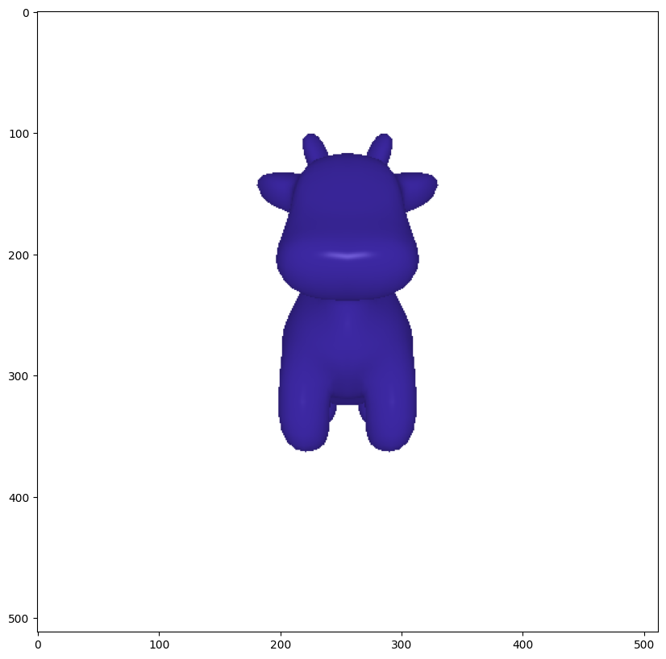</img>

## 1. Practicing with Cameras

### Spinning cow with solid color
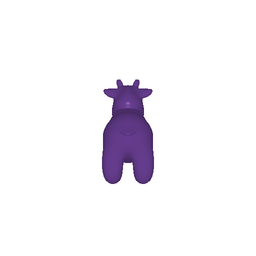

### Dolly Zoom effect
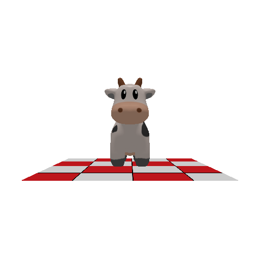

## 2. Practicing with Meshes

### Tetrahedron
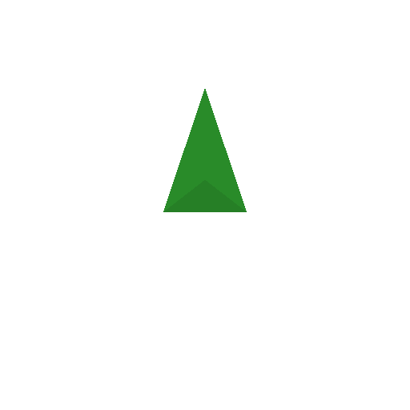

### Cube
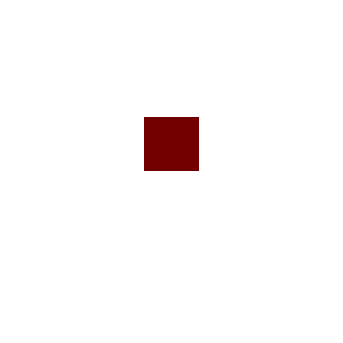

## 3. Re-texturing a Mesh
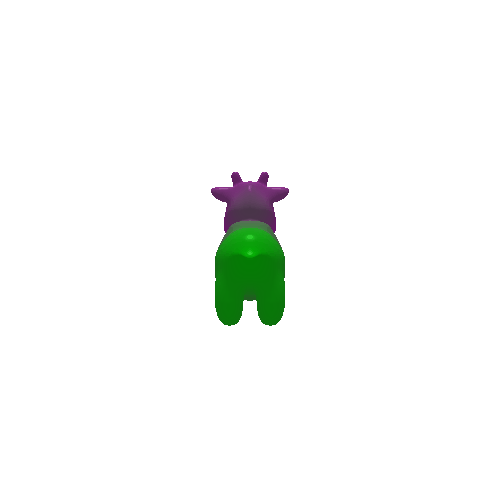

## 4. Camera Transformation

- `T_relative` transform the position of the world origin relative to camera space.
    + `T_relative` takes the form of `[x, y, z]`
    + `x` moves the origin to the left if positive, right if negative.
    + `y` moves the origin up if positive, down if negative.
    + `z` moves the origin further into the screen if positive, in opposite direction if negative.

- `R_relative` rotates the camera around the origin (extrinsic rotation). Given `R_roll`, `R_pitch`, `R_yaw` being the individual (relative) rotational matrices, `R_relative` = `R_roll @ R_pitch @ R_yaw`

### Original rotation and transformation

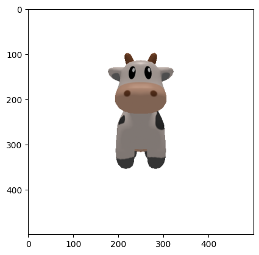

### Transformations

1\.
```
R_relative = [
    [cos(-pi / 2), -sin(-pi / 2), 0],
    [sin(-pi / 2), cos(-pi / 2), 0],
    [0, 0, 1]
]

T_relative = [0, 0, 0]
```

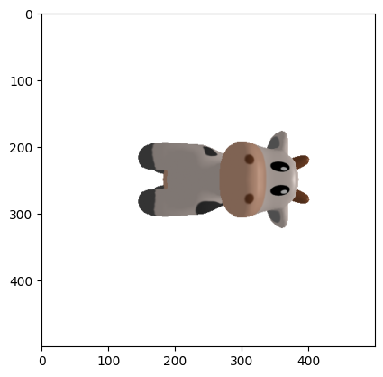

2\.
```
R_relative = [
    [1, 0, 0],
    [0, 1, 0],
    [0, 0, 1]
]

T_relative = [0, 0, 2]
```

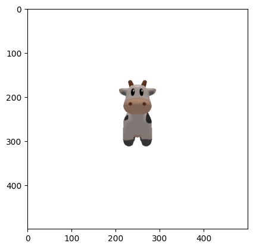

3\.
```
R_relative = [
    [1, 0, 0],
    [0, 1, 0],
    [0, 0, 1]
]

T_relative = [0.5, -0.5, 2]
```

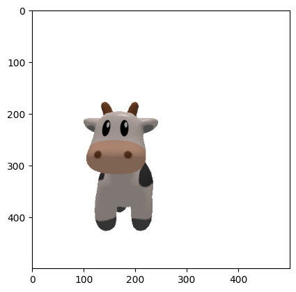

4\.
```
R_relative = 
[
    [cos(pi/2), 0, sin(pi/2)],
    [0, 1, 0],
    [-sin(pi/2), 0, cos(pi/2)]
]

T_relative = [0, 0, 0]
```

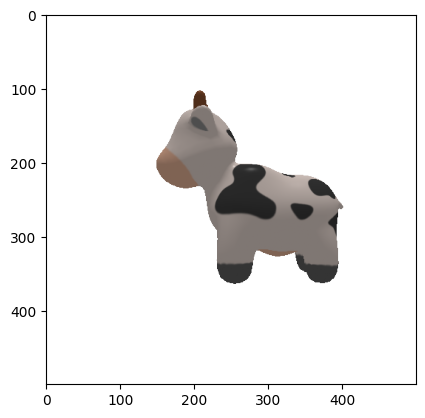

## 5. Rendering Generic 3D Representations

### 5.1 Rendering Point Clouds

> *From left to right: Point cloud for image 1, image 2, combined*

<div style="display: flex; gap: 10px">
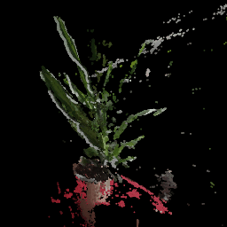
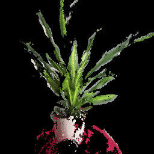
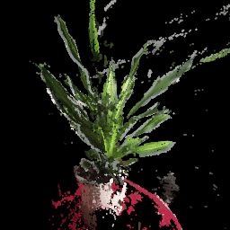
</div>

### 5.2 Parametric Functions

1. Torus

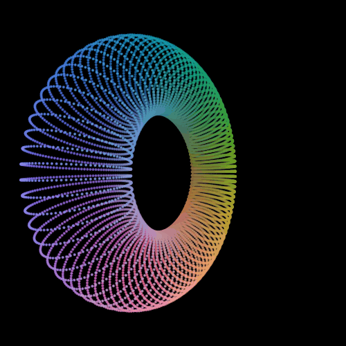

2. Hyperboloid

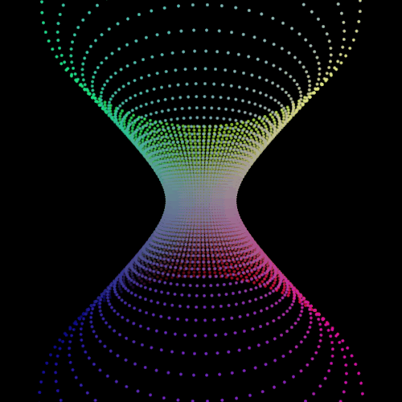

### 5.3 Implicit Surface

<br>


1\. Torus


<br>

2\. Hyperboloid

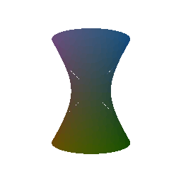

<br>

3\. Trade-offs between rendering a mesh vs a point cloud

> Discuss some of the tradeoffs between rendering as a mesh vs a point cloud. Things to consider might include rendering speed, rendering quality, ease of use, memory usage, etc.

- Point clouds:
    + Higher rendering quality (by being able to capture fine details and textures)
    + Higher memory usage (especially for rendering dense regions of point cloud)
    + Lower ease-of-use (point cloud must be pre-processed before it can be used in 3D applications)
    + Lower rendering speed

- Meshes:
    + Lower rendering quality
    + Lower memory usage
    + Higher ease-of-use
    + Higher rendering speed

## 6. Do Something Fun


## 7. Sampling Points on Meshes

> Sampling to cloud point: 10, 100, 1000, 10000 and 100000 points.

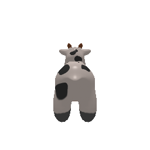
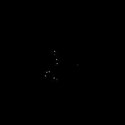
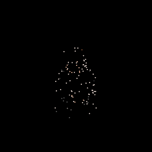
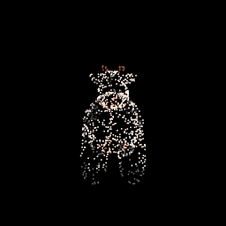
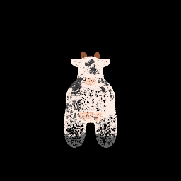
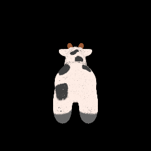
